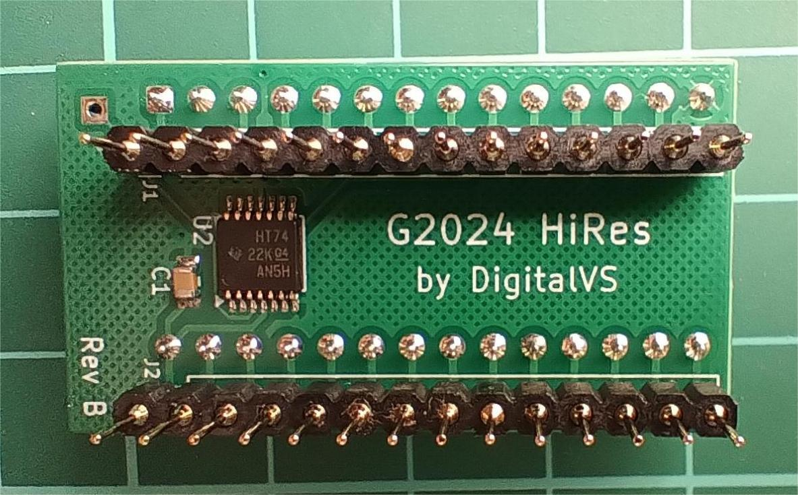
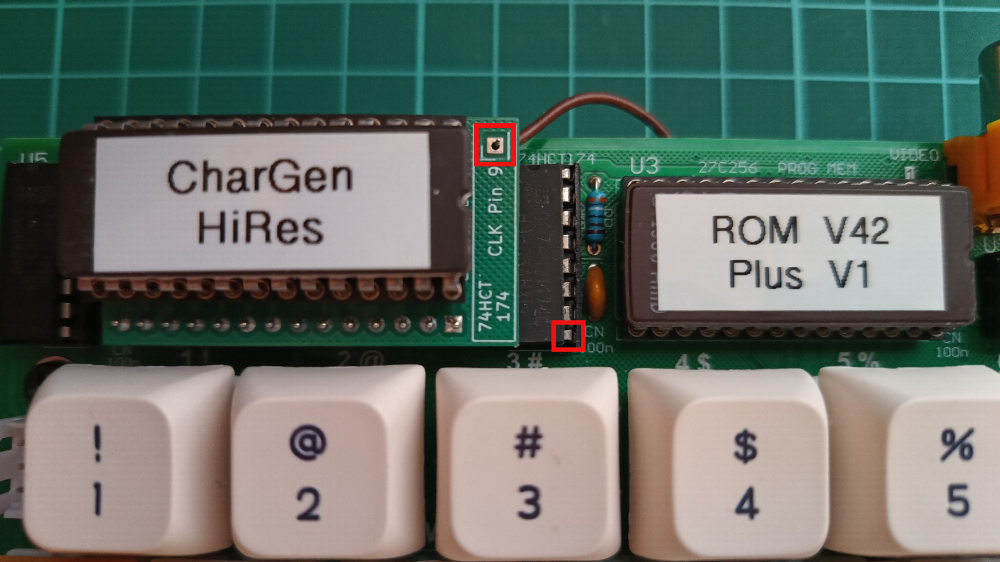
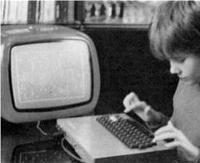
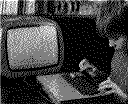

# Galaksija 2024 High Resolution

This is a high resolution expansion project for [Galaksija](https://en.wikipedia.org/wiki/Galaksija_(computer)) 2024 retro computer, which is in its original form limited to character screen display. It is a hardware and software expansion of the Galaksija 2024 computer to achieve graphics resolution of 256 x 208 pixels. Software part of the project is mostly port of Galaksija Plus ROM C to newer Galaksija 2024 and it has high level of compatibility with Galaksija Plus.

This document covers the following subjects:

- [Hardware description and PCB installation](#hardware)
- [Screen editor and new BASIC commands](#software)
- [Creating high resolution graphics](#creating-graphics)
- [Software development tips](#dev-tips)

<h2 id="hardware">Hardware Description</h2>

Hardware of the High Resolution expansion is extremely simple. It consists of only one flip-flop which switches from character based mode to graphics mode and vice versa. This flip-flop extends Galaksija's, so called, *latch* circuit from six to seven bits and is handled exclusively by Galaksija's graphics raster generation service routine.



Output of the flip-flop is connected to the character's generator A12 line. This means that high resolution image goes through character generator EPROM, which is bit unusual, but is possible because this EPROM chip has greater then needed capacity and all eight data bus lines are connected to EPROM address lines. Each of the 256 possible data bus values addresses single EPROM cell where that same value has been stored. Thus, character generator is used to transfer any data bus value to the shift register connected to its output data lines.

Since the high resolution image data goes through character generator, that means that character generator chip has to be replaced or reprogrammed before using new high resolution capabilities. Note that if reprogrammed, chip does not need to be erased before reprogramming - new contents can be reprogrammed with old contents left in the chip, because new contents is added while old is unchanged and will not be altered.

Folder *hardware* contains Gerber files, schematics, BOM list and character generator binary file needed for making high resolution expansion.

### Installation Procedure

The flip-flop is soldered to small PCB which plugs into the character generator socket (U4 on the Galaksija 2024 schematics) and character generator chip is then plugged to this PCB. Additionally, one of necessary signals, not available at character generator socket, has to be brought to the marked solder pad by short wire. This signal is CLK signal from neighboring 74HCT174 chip (U6, pin number 9).

The following picture shows points that need to be connected marked with red squares. It is easiest to connect wire to 74HCT174 pin 9 by soldering it on bottom side of the PCB.



ROM chip, usually labeled as *BASIC*, has to be changed or reprogrammed with new software as well.

<h2 id="software">New ROM Software</h2>

Software consists of screen editor and eighteen BASIC commands. Syntax of the commands is the same as on Galaksija Plus. Screen editor itself and a number of new commands are not related to high resolution functionality, and work in text mode as well. This makes this project more general then just adding high resolution features and it can be also called the __Galaksija 2024 Plus__ project though.

Source code is published in __plus.asm__ file. This file is supposed to be assembled together with the rest of the sources for Galaksija 2024 ROM, but these other files are not published here. Only resulting binary ROM file is published in release section of this repository.

After the Galaksija's startup, computer is booted in its main text mode and, therefore, high resolution and other new capabilities are not yet available. New features are available only after the initialization with command `A=USR(&E000)`.

### Screen Editor

Screen editor is the same Galaksija Plus editor with few small fixes. It works only in overwrite mode, which is unusual by modern standards, but expected considering how few keys the keyboard has (e.g. no backspace, home and control keys).

Characters after the cursor are deleted with DEL key, and space for new characters is created with SHIFT + "-" key combination.

### BASIC Commands

New BASIC commands, including unofficial command R2, are: GRAPH, TEXT, PLOT, UNPLOT, DRAW, UNDRAW, FILL, SOUND, LINE, FAST, SLOW, CLEAR, KILL, DESTROY, AUTO, UP, DOWN, R2.

Graphics commands work with graphics coordinates, where (0,0) point is in lower-left corner, and (255,207) is in upper-right corner. The coordinate value is kept within visible area by calculating value further by modulo 256. Vertical coordinate values from 208 to 255 are equal to value 0. Vertical resolution is adjustable from 49 to 208 lines with LINE command.

Graphics mode allocates 6.5 kilobytes for video memory, together with additional 32 bytes for its internal variables. This memory is initially allocated at the top of the RAM, but can be relocated elsewhere.

Graphics mode uses its own character set which may be redefined.

#### GRAPH and TEXT

`GRAPH` command switches Galaksija to graphics mode and `TEXT` switches back to text mode.

#### PLOT and UNPLOT

`PLOT x,y` turns-on point at coordinates x,y, and `UNPLOT x,y` turns-off point at coordinates x,y. Both commands set new current point location at coordinates x,y.

#### DRAW and UNDRAW

`DRAW x,y` draws a strait line from current point location to the new point location at coordinates x,y. `UNDRAW x,y` turns-off points on a strait line from current point location to the new point location at coordinates x,y.

#### FILL

Command `FILL x,y` fills with white color shape enclosed around point x,y. This is equivalent to use of *paint bucket* option in modern drawing tools.

#### SOUND

This command generates sound by manipulating register values of sound generator chip, like Yamaha YM2149 and other compatible models. Command syntax is `SOUND register,value` where *register* is YM2149 register number from 0 to 15 and *value* is value from 0 to 255 to be written to the target register. In case that [sound generator](https://github.com/DigitalVS/Galaksija-Resources/blob/main/README.md#g2024-ym2149-sound-generator) is not available, this command has no effect.

#### LINE

`LINE n` command sets new vertical resolution value. Acceptable value is from 49 to 208. Sometimes setting lower then maximum value is useful, at least for short period of time, because it leaves more CPU cycles to application software and thus improves speed.

#### FAST and SLOW

`FAST` command will switch Galaksija to fast mode of operation when picture is not generated and `SLOW` command will revert this to normal mode of operation with visible picture on the screen.

#### CLEAR

Initial value of all numeric variables is 0.5. The `CLEAR` command will set all numeric variables value to true zero.

#### KILL and DESTROY

Command `KILL` will reinitialize the computer, the same way as command `PRINT USR(0)`. Before reinitialization it will ask for confirmation.

Command `DESTROY n,m` will clear the memory from address *n* to address *m*, setting all byte values to zero.

#### AUTO

`AUTO n,m` will automatically generate BASIC program numbers starting from number *n* with step *m*. If autogenerated program line already exists, warning will be displayed. With pressing the ENTER key, existing line will stay in memory, otherwise it will be rewritten with new typed contents.

#### UP and DOWN

`UP n` command will move BASIC program up for *n* bytes. `DOWN n` command will move BASIC program *n* bytes down.

#### R2

This is unofficial command which de-initializes high resolution mode and all other Plus features and puts Galaksija in its main text mode of operation. Basically its effect is the same as a computer reset, except that RAM contents is preserved.

<h2 id="creating-graphics">Creating High Resolution Graphics</h2>

Here will be briefly described how to use [GIMP](https://www.gimp.org/) with a couple of tools from this repository to create high resolution graphics. Instead of GIMP you may use other software of your choice, for example Adobe Photoshop.

Firstly, use GIMP to create black and white image file. Then use helper programs from *tools* directory to convert this image file to format usable on Galaksija.

### Creating Black and White Image File

High resolution graphics has to be black and white, 1-bit per pixel data format image. This format is supported by Portable BitMap (PBM) file type.

To save a 1-bit black and white raw image (1-bit per pixel, no header, raw binary data) in GIMP, you must convert the image to an indexed black and white mode and then export it using the PBM format, which supports raw binary output.

Step-by-step instructions:

- Prepare the image: Open your image in GIMP
- Convert to 1-bit (monochrome):
  - Go to Image > Mode > Indexed...
  - Select Use black and white (1-bit) palette
  - Choose color dithering of your choice
  - Click Convert
- Export as raw PBM:
  - Go to File > Export As...
  - Name your file with a .pbm extension (e.g., image.pbm)
  - Click Export
- Configure PBM settings:
  - In the PBM export dialog, select Raw PBM (not ASCII) to ensure it is raw binary data
  - Click Export

Next two images show source greyscale image example on the left, and a resulting black and white image on the right. Conversion to black and white image of such small resolution (256 x 208) leads to obvious loss of quality but this is used here just as a working example. In a real world use case, you will not convert photography pictures to Galaksija graphics, and even if you do, you will use various filters and other GIMP tools to achieve better results. Note also that Galaksija's picture on LCD monitors is stretched out, especially in horizontal direction, and that that further distorts the picture.

&nbsp;&nbsp;&nbsp;&nbsp;&nbsp;

### Converting PBM File to Galaksija Graphics

Next Python tools are available to convert portable bitmap file to format usable on Galaksija:

- __pbm2bin__ converts portable bitmap file to binary file type. Basically, it just removes headers from portable bitmap file, reverse bit order of each byte and saves it to binary file of the same name. That kind of data can be further used in Galaksija programs. The picture has to be 256 pixels wide and, optionally, this tool can fill it on the bottom side to full 208 lines if needed. To see full command syntax, type `python pbm2bin.py -h` line in the command prompt window.

- __pbm2gtp__ converts portable bitmap file to GTP file type. Resulting GTP file is a self contained program with embedded picture inside of it. When executed on Galaksija, it displays the picture and waits for *space* key press to exit the program. Note that this program uses *pbm2bin* tool and *image.gtp* binary file. Thus, both of these files have to be in the same directory as *pbm2gtp*. This tool has only one parameter - the name of portable bitmap file to be converted.

Both tools are Python 3 programs and use only modules already installed with Python.
For completeness, assembly source code for *image.gtp* is also published here.

<h2 id="dev-tips">High Resolution Software Development Tips</h2>

BASIC commands described in previous text are easy to use but, due to Galaksija's inherent slowness, more complex programs are only possible to make in a machine language. Thus, here will be listed few tips about assembly program development. This is not meant to be comprehensive tutorial, nor the only correct way to do certain things, it is meant to be just a brief help to kick-off with writing first Galaksija high resolution programs.

### ROM Initialization

As already mentioned, initialization is done with command `A=USR(&E000)`. Leave this step to the user. It has to be done once and only once, after every computer startup or reset. If needed, put in documentation for your application that user have to do this prior to starting the program. Otherwise, if this step is executed multiple times (manually and/or programmatically), you will experience loosing the RAM memory, because RAMTOP will be lowered multiple times, too.

### Switching to Graphics Mode

This is the first step that should be done programmatically. Graphic mode is determined by contents of *horizontal text position* variable at address &2BA8. Store in this location value &FF for graphics mode or value &16 for text mode of operation.

This step and the next step (RAM initialization), may be executed with disabled interrupts but seems that it's not strictly necessary.

### RAM Initialization

This step allocates high resolution graphics RAM memory and sets some internal variable values. It is done by executing `CALL &E055` instruction and is allowed to be executed multiple times (memory will not be reserved multiple times unless ROM initialization step is repeated, which would overwrite some internal variable values). Thus, this step should be part of each program initialization.

### Clearing the Graphics RAM

Complete RAM memory is initially filled with zeros and previously listed initialization steps do not alter its contents. That means that whole working area of 256 x 208 pixels would be initially displayed in white color, even if it is expected to be black. To avoid this, after graphics memory allocation,  memory is cleared by setting all bytes to value &FF.

However, all characters put on a character screen with `RST &20` are via video link copied to the same location on a graphics screen. This means that whenever program starts, graphics memory is not in cleared state and that it should be explicitly cleared.

Graphics memory can be cleared in two ways. First, all 6.5 kilobytes can be set to &FF in a loop. This is probably fastest, but not the shortest way to clear graphics memory. Shorter way to clear the graphics memory is to clear the character video memory and leave the video link routine to clear the graphics memory itself. This can be done with only two instructions:

```z80
LD   A, $0C     ; Form feed character
RST  $20
```

### Plot a Dot

Authors of plot and line drawing ROM routines didn't pay too much attention to how that code would be used from application software. Nevertheless, it's not that difficult to use it from other programs.

Put Y plot coordinate to H register and X coordinate to L register (or use BC or DE registers instead), then push HL register to the stack. Set Z flag by clearing A register for choosing Plot operation. Finally, call plot ROM subroute at address &E161, as shown by the next code example.

```z80
LD HL, $3264  ; Plot coordinates: Y = 50, X = 100
PUSH HL       ; Y, X parameters are passed via stack
XOR A         ; A = 0, Zf = 1 flag for PLOT, A <> 0, Zf = 0 for UNPLOT
CALL $E161    ; Plot/unplot subroutine call
```

### Line Drawing

Passing line drawing parameters is a bit different then for plot operation. X and Y coordinates are passed in BC register pair. Draw or undraw operation is determined by state of Z flag, similarly as for plot, but this time it needs to be passed via the stack.

Draw subroutine is at address &E104. After it finishes, arithmetic stack state have to be restored.

```z80
LD   BC, $64C8        ; Line end coordinates: Y = 100, X = 200
XOR  A                ; DRAW: A = 0, Zf = 1, UNDRAW: A <> 0, Zf = 0
PUSH AF
CALL $E104            ; Draw/undraw subroutine call
LD   IX, ARITHMACC    ; Restore FP stack pointer changed in DRAW subroutine
POP  AF               ; Clear the stack
```

> Drawing vertical and especially horizontal lines executes much faster by directly writing to graphics memory than using ROM drawing routines.

### Program Example

Here is a complete example which summarizes all above tips at one place.

It turns-on and initializes graphics mode, and clears the screen afterwards. Then it draws one point at coordinates (100, 50) and, finally, draws a line from that point to coordinates (200, 100).

```z80
; Galaksija variables
TEXTHORPOS   = $2BA8 ; Horizontal text position, also determines text or graphics mode of operation
ARITHMACC    = $2AAC ; FP arithmetic accumulator/stack

; High resolution subroutines
InitGraphics = $E055
Plot         = $E161
DrawLine     = $E104

    ORG $3000

Start:
    LD   A, 255           ; Set graphics mode indicator = 255
    LD   (TEXTHORPOS), A
    CALL InitGraphics     ; Initialize graphics mode if not already initialized
    LD   A, $0C           ; Form feed character
    RST  $20              ; Clear the screen

    LD   HL, $3264        ; Plot coordinates: Y = 50, X = 100
    PUSH HL               ; Y, X parameters are passed via stack
    XOR  A                ; PLOT: A = 0, Zf = 1, UNPLOT: A <> 0, Zf = 0
    CALL Plot             ; Plot/unplot subroutine call

    LD   BC, $64C8        ; Y = 100, X = 200
    XOR  A                ; DRAW: A = 0, Zf = 1, UNDRAW: A <> 0, Zf = 0
    PUSH AF
    CALL DrawLine         ; Draw/undraw subroutine call
    LD   IX, ARITHMACC    ; Restore FP stack pointer changed in DRAW subroutine
    POP  AF               ; Clear the stack
    RET
```

## Troubleshooting

There is a well known issue with Galaksija 2024 picture which is even more visible in graphics mode in which this expansion works.

This issue is manifested in text mode as ghost pixels for characters wider then six pixels. For example, two asterisk characters placed side by side are displayed as joined in the middle, even there should be one pixel wide gap between them. In graphics mode this is much more obvious, and seen as, at every eight horizontal pixels, first column displayed twice and eighth column not displayed at all.

Fortunately, solution is simple, by soldering small ceramic capacitor with capacitance of 470 pF between pin 9 and ground (pin 7) of chip 74HCT74 (U18) on Galaksija 2024 main PCB. It is easiest to solder it underneath of the 74HCT74 on the other side of the board. If you wish, you can first try smaller capacitor values if it fixes the problem, for example, 330 or 390 pF, because required value may slightly vary with manufacturer and family of ICs used on each single instance of Galaksija.

The MIT License (MIT)

Copyright (c) 2026 Vitomir Spasojević (<https://github.com/DigitalVS/Galaksija-2024-High-Resolution>). All rights reserved.
